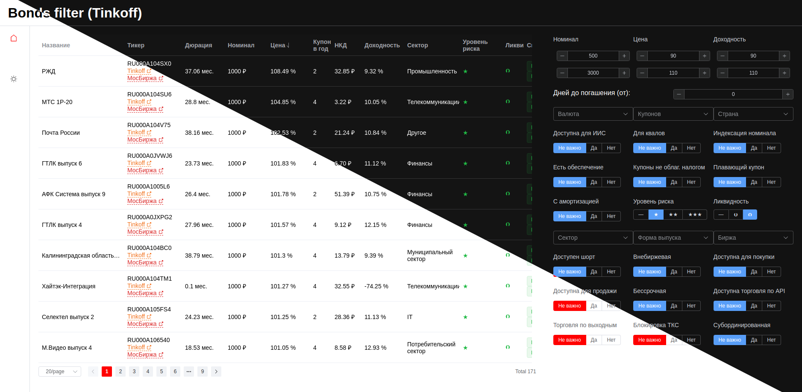

# Bonds filter (Tinkoff)

Подбор облигаций для покупки доступных у брокера Тинькофф.



Часть данных собирается из [Tinkoff Invest API](https://tinkoff.github.io/investAPI/), часть
из [API Московской биржи](https://www.moex.com/a2193).
 
⚠ Поскольку сбор данных занимает долгое время, при запуске сервера запускается сбора данных по расписанию (раз в 4
часа).

## Установка

Из исходного кода:

```bash
# Загрузка исходного кода
$ git clone https://github.com/rame0/bonds-filter-tinkoff.git
```

## Запуск

Варианты запуска:

* [Docker](#docker)
* [Исходный код](#запуск-из-исходников)
* [Kubernetes] (в разработке)

> На данный момент рекомендуется запускать из исходников.
> Запуск из Docker сейчас требует наличие установленного и настроенного `Traefik`.

### Предварительная настройка

В папке `server`, скопируйте файл `.env.example` в `.env` и откройте его в любом текстовом редакторе.

Для работы приложения нужно получить токен для доступа к [Tinkoff Invest API](https://tinkoff.github.io/investAPI/).
Для этого нужно:

1. Зарегистрироваться в [Tinkoff Invest](https://www.tinkoff.ru/invest/).
2. Перейти в [личный кабинет](https://www.tinkoff.ru/invest/settings/).
3. В самом низу страницы будет раздел "Токены Tinkoff Invest API"
4. Нажать на кнопку "Создать токен".
5. В открывшемся окне выбрать счет (или оставить по умолчанию "Все счета")
    * Для большей безопасности, можно создать отдельный пустой счет и использовать его, поскольку приложению нужно
      только API. Ему не нужен доступ к портфелю и операциям.
6. Поставить галочку на "Только для чтения" (это важно, чтобы приложение точно не могло ни чего делать со счетом)
7. Нажать на кнопку "Выпустить токен"
8. В открывшемся окне нажмите "Скопировать токен"

Этот токен нужно вставить в открытый файл `.env`. В свойство `TINKOFF_API_TOKEN`. Должно получиться так:

```dotenv
# Тинькоф API токен
TINKOFF_API_TOKEN=t.j6Ij**************tmQDoD4-J1LJc8f9sFvC7HWb****************************************UCEzA

# ID боевого счете
REAL_ACCOUNT_ID=
# ID счета в песочнице
SANDBOX_ACCOUNT_ID=
```

Все остальные свойства можно не заполнять. В данной версии они не нужны.

Сохраните и закройте файл.

## Запуск из исходников

### Требования

* [Node.js](https://nodejs.org/en/) 16 или старше.
* [pnpm](https://pnpm.io/) 8 или старше.
    * Можно использовать и `npm`, но `pnpm` работает быстрее и использует меньше места на диске.
    * Если используется `npm`, то вместо `pnpm` в командах ниже нужно использовать `npm`.

### Установка зависимостей

Переходим в папку с проектом:

```bash
$ cd bonds-filter-tinkoff
```

Устанавливаем зависимости сервера:

```bash
$ cd server && pnpm install && cd ..
```

Устанавливаем зависимости UI:

```bash
$ cd UI && pnpm install && cd ..
```

### Запуск

Для запуска нужно открыть 2 окна терминала и в каждом из них перейти в папку с проектом.

В первом окне запускаем сервер:

```bash
$ cd server && pnpm start
```

Результат выполнения команды должен быть примерно такой:

```log
> bonds-filter-tinkoff@1.1.0 start /home/ra/projects/bonds-filter-tinkoff/server
> ./node_modules/.bin/moleculer-runner --config dist/moleculer.config.js dist/src/services/{**,**/**,**/**/**}/*.service.js

[2023-08-13T13:04:08.740Z] INFO  ra-243915/BROKER: Moleculer v0.14.28 is starting...
...
...
[2023-08-13T13:04:08.953Z] INFO  ra-243915/$NODE: Service '$node' started.
[2023-08-13T13:04:08.953Z] INFO  ra-243915/BONDS: Service 'bonds' started.
[2023-08-13T13:04:08.953Z] INFO  ra-243915/API: API Gateway listening on http://0.0.0.0:3000
...
...
[2023-08-13T13:04:08.955Z] INFO  ra-243915/BROKER: ✔ ServiceBroker with 3 service(s) started successfully in 9ms.
[2023-08-13T13:04:09.457Z] DEBUG ra-243915/BROKER: Broadcast '$api.aliases.regenerated' event.
[2023-08-13T13:04:09.457Z] DEBUG ra-243915/BROKER: Broadcast '$api.aliases.regenerated' local event.


```

Во втором окне запускаем UI:

```bash
$ cd UI && pnpm preview
```

Результат выполнения команды должен быть примерно такой:

```log
> bonds-filter-tinkoff@0.0.0 preview /home/ra/projects/bonds-filter-tinkoff/UI
> vite preview

  ➜  Local:   http://localhost:4173/
  ➜  Network: use --host to expose
```

Интерфейс доступен по адресу указанному в консоли (в примере выше это `http://localhost:4173/`).

## Docker

### Требования

* [Docker](https://www.docker.com/)
* [Docker Compose](https://docs.docker.com/compose/)
* [Traefik](https://doc.traefik.io/traefik/)

### Установка

! Текущая реализация требует наличия `Traefik`. В будущем это будет исправлено.

Нужно добавить в файл `/etc/hosts` запись:

```text
127.0.0.1       bonds-filter.local
```

Переходим в папку с проектом:

```bash
$ cd bonds-filter-tinkoff
```

Запускаем:

```bash
docker-compose up --build -d
```

После успешной сборки и запуска контейнеров, интерфейс будет доступен по
адресу [http://bonds-filter.local/](http://bonds-filter.local/).
